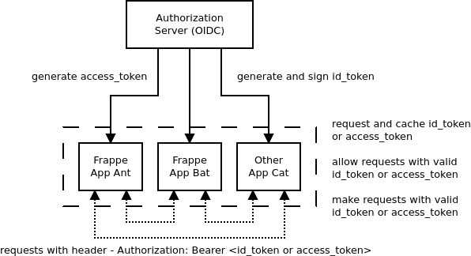

# Castlecraft Auth

Frappe App for Castlecraft Authorization.

It requires Authorization Server with following features:

- Capability to generate `id_token` signed using JWKS
- `/.well-known/jwks` endpoint which returns set of public keys.

After installation of this app, request to frappe app can be made using `id_token` jwt signed using jwks.

## Usage Diagram



## Installation

Note: Works on version 13 onwards.

```shell
bench get-app castlecraft_auth https://gitlab.com/castlecraft/castlecraft_auth.git
bench --site <site-name> install-app castlecraft_auth
```

## Configuration

Make following changes in `site_config.json` or `common_site_config.json` as per your setup:

```json
{
 ...
 "castlecraft_jwks_url": "https://accounts.example.com/.well-known/jwks",
 "castlecraft_allowed_aud": ["client_id_or_allowed_aud_claim"],
 "castlecraft_create_user_on_auth": 1
}
```

- `castlecraft_jwks_url`: JWKS Url to verify `id_token` signature (asymmetric).
- `castlecraft_allowed_aud`: Array of allowed audience claim in `id_token`.
- `castlecraft_create_user_on_auth`: When set to `1`, user with no roles will be created if not found in system.

## License

Copyright 2021 Castlecraft Ecommerce Pvt. Ltd.

Permission is hereby granted, free of charge, to any person obtaining a copy of this software and associated documentation files (the "Software"), to deal in the Software without restriction, including without limitation the rights to use, copy, modify, merge, publish, distribute, sublicense, and/or sell copies of the Software, and to permit persons to whom the Software is furnished to do so, subject to the following conditions:

The above copyright notice and this permission notice shall be included in all copies or substantial portions of the Software.

THE SOFTWARE IS PROVIDED "AS IS", WITHOUT WARRANTY OF ANY KIND, EXPRESS OR IMPLIED, INCLUDING BUT NOT LIMITED TO THE WARRANTIES OF MERCHANTABILITY, FITNESS FOR A PARTICULAR PURPOSE AND NONINFRINGEMENT. IN NO EVENT SHALL THE AUTHORS OR COPYRIGHT HOLDERS BE LIABLE FOR ANY CLAIM, DAMAGES OR OTHER LIABILITY, WHETHER IN AN ACTION OF CONTRACT, TORT OR OTHERWISE, ARISING FROM, OUT OF OR IN CONNECTION WITH THE SOFTWARE OR THE USE OR OTHER DEALINGS IN THE SOFTWARE.
